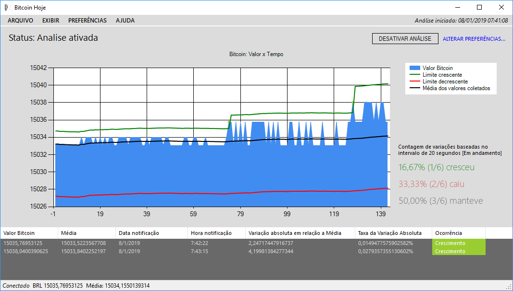

# Bitcoin Price Variation Analysis

Developed as part of the Capstone Project for the Computer Engineering course, this application provides users with an analytical environment to monitor and interpret Bitcoin cryptocurrency price fluctuations.

This version was developed using **C#** with **.NET Framework** for **Windows Forms** applications, enabling a rich **desktop UI** experience. The system consumes a **public RESTful API** to retrieve **real-time JSON data** representing Bitcoin prices. These data points are then dynamically processed and displayed through an **on-screen charting component**, allowing users to visualize trends and historical variations.

## Key Features

- Developed with **.NET Framework** and **Windows Forms**.
- Integration with **public REST API** for **Bitcoin price data retrieval**.
- **JSON deserialization** and data manipulation.
- Real-time **graph generation** to visualize Bitcoin price trends.
- User-configurable **thresholds** for upper and lower Bitcoin price limits with **notifications** when these limits are exceeded.
- Capability to analyze **price variations** over a specified **time interval**.
- A separate branch is available featuring **Fibonacci Retracement Analysis** integrated into the chart, providing advanced **technical analysis** tools for deeper insights.

